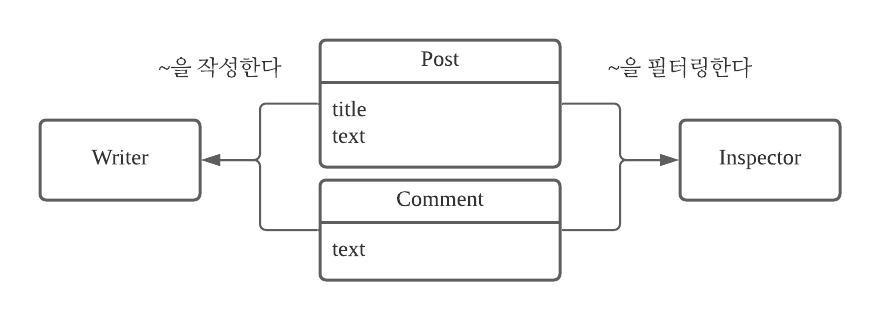

# 블로그 API 개발 프로젝트

팀원: 상진수  
시작일: 2021년 2월 22일

## 1. 프로젝트 소개

### 프로젝트 선정 이유

- 마이크로서비스 아키텍처 연습
- Nest.js, Typescript 스킬 향상
- MongoDB Node.js Driver 사용 연습

### 프로젝트 주제

- 블로그 사용자가 로그인하고 포스트, 댓글, 대댓글을 작성하는 서비스

### 프로젝트 언어 및 환경

- 언어: Typescript
- 프레임워크: Nest.js
- 데이터베이스: MongoDB

### 주요 기능

- 작성자 로그인, 로그아웃 기능
- 작성자 탈퇴 기능
- 작성자 비밀번호 변경 기능
- 포스트 생성 / 변경 / 삭제 기능
- 댓글 생성 / 변경 / 삭제 기능
- 작성자 포스트 및 댓글 검색 기능
- 나쁜 언어 필터링 기능

---

## 2. 마이크로서비스 아키텍처 정의

### 1단계: 도메인 모델 생성

#### 사용자 시나리오1

- 전제(Given)

  - 작성자가 있다.
  - 작성자는 로그인 되어있다.

- 조건(When)

  - 작성자가 블로그 포스트를 작성한다.

- 결과(Then)
  - 블로그 포스트가 작성된다.

#### 사용자 시나리오2

- 전제(Given)

  - 작성자가 있다.
  - 작성자는 로그인 되어있다.

- 조건(When)

  - 작성자가 포스트에 댓글을 작성한다.

- 결과(Then)

  - 포스트에 댓글이 달린다.

#### 사용자 시나리오3

- 전제(Given)

  - 작성자가 있다.
  - 작성자는 로그인 되어있다.

- 조건(When)

  - 작성자가 댓글에 대댓글을 작성한다.

- 결과(Then)
  - 댓글에 대댓글이 달린다.

#### 사용자 시나리오4

- 전제(Given)

  - 작성자가 있다.

- 조건(When)

  - 작성자가 나쁜 언어를 사용해 포스트와 댓글을 작성한다.

- 결과(Then)
  - 나쁜 언어가 필터링 되어 \*\*\*\* 표시된다.

#### 클래스 다이어그램

  
### 2단계 시스템 작업 정의
  
#### 1. 시스템 커맨드

|      액터 |       스토리        |        커맨드         |           실행            |
| --------: | :-----------------: | :-------------------: | :-----------------------: |
|    Writer |     포스트 생성     |     createPost()      |    포스트를 생성한다.     |
|    Writer |      댓글 생성      |    createComment()    |     댓글를 생성한다.      |
|    Writer |     대댓글 생성     | createNestedComment() |    대댓글을 생성한다.     |
|    Writer |   포스트 업데이트   |     updatePost()      |  포스트를 업데이트한다.   |
|    Writer |    댓글 업데이트    |    updateComment()    |   댓글를 업데이트한다.    |
|    Writer |   대댓글 업데이트   | updateNestedComment() |  대댓글을 업데이트한다.   |
|    Writer |     포스트 삭제     |     deletePost()      |    포스트를 삭제한다.     |
|    Writer |      댓글 삭제      |    deleteComment()    |     댓글를 삭제한다.      |
|    Writer |     대댓글 삭제     | deleteNestedComment() |    대댓글을 삭제한다.     |
|    Writer |      회원가입       |       signup()        |     회원가입을 한다.      |
|    Writer |       로그인        |        login()        |       로그인 한다.        |
|    Writer |      로그아웃       |       logout()        |      로그아웃 한다.       |
|    Writer |        탈퇴         |      withdraw()       |     회원을 탈퇴한다.      |
| Insepctor | 포스트 제목 필터링  |   filterPostTitle()   | 포스트 제목을 필터링한다. |
| Insepctor |  포스트 글 필터링   |   filterPostText()    |  포스트 글을 필터링한다.  |
| Insepctor | 댓글(대댓글) 필터링 |    filterComment()    |    댓글을 필터링한다.     |

#### 2. 쿼리

|   액터 |                스토리                |          커맨드           |                   실행                    |
| -----: | :----------------------------------: | :-----------------------: | :---------------------------------------: |
| Writer |   포스트 한 개의 글과 댓글을 본다    |       findOnePost()       |          포스트 정보를 가져온다.          |
| Writer |          모든 포스트를 본다          |      findAllPosts()       |       모든 포스트 정보를 가져온다.        |
| Writer | 작성자 한 명이 쓴 모든 포스트를 본다 |  findAllPostsOfWriter()   | 작성자 한 명이 쓴 모든 포스트를 가져온다. |
| Writer | 작성자 한 명이 쓴 모든 댓글들을 본다 | findAllCommentsOfWriter() |  작성자 한 명이 쓴 모든 댓글을 가져온다.  |

### 3. 서비스 매핑

| 서비스 |                                                       작업                                                        |
| -----: | :---------------------------------------------------------------------------------------------------------------: |
| 포스트 |                                      createPost() deletePost() updatePost()                                       |
|   댓글 | createComment() createNestedComment() updateComment() updateNestedComment() deleteComment() deleteNestedComment() |
| 로그인 |                                       signup() login() logout() withdraw()                                        |
|   쿼리 |                   findOnePost() findAllPosts() findAllPostsOfWriter() findAllCommentsOfWriter()                   |
